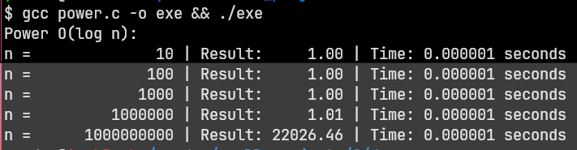

```c
#include <stdio.h>
#include <time.h>

typedef long long LL;

double power_iter(double base, LL exponent) {
        double result = 1.0;

        while (exponent > 0) {
                if (exponent % 2 == 1) {
                        result *= base;
                }

                base *= base;
                exponent /= 2;
        }

        return (exponent < 0) ? 1.0 / result : result;
}

void measure_time(double base, LL exponent) {
        clock_t start, end;
        double cpu_time_used;

        start = clock();
        double res = power_iter(base, exponent);
        end = clock();

        cpu_time_used = ((double)(end - start) / CLOCKS_PER_SEC);

        printf("n = %15lld | Result: %8.2f | Time: %f seconds\n", exponent, res, cpu_time_used);
}

int main() {
        double base = 1.00000001;
        LL exponents[] = {10, 1e2, 1e3, 1e6, 1e9};

        printf("Power O(log n):\n");

        for (int i = 0; i < 5; i++) {
                measure_time(base, exponents[i]);
        }

        return 0;
}
```


